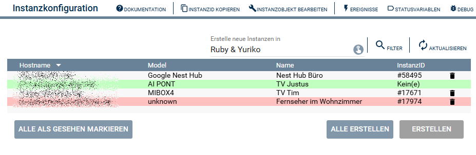

  

  

  

# Chrome Cast Discovery   <!-- omit in toc -->  

Auffinden von Chrome Cast fähigen Geräten im Netzwerk.  

## Inhaltsverzeichnis   <!-- omit in toc -->  

- [1. Funktionsumfang](#1-funktionsumfang)
- [2. Voraussetzungen](#2-voraussetzungen)
- [3. Software-Installation](#3-software-installation)
- [4. Einrichten der Instanzen in IP-Symcon](#4-einrichten-der-instanzen-in-ip-symcon)
- [5. Statusvariablen](#5-statusvariablen)
- [6. Visualisierung](#6-visualisierung)
- [7. PHP-Befehlsreferenz](#7-php-befehlsreferenz)
- [8. Anhang](#8-anhang)
  - [1. Changelog](#1-changelog)
  - [2. Spenden](#2-spenden)
- [9. Lizenz](#9-lizenz)

## 1. Funktionsumfang

- Auffinden von Chrome Cast fähigen Geräten im Netzwerk  
- Einrichten der Instanzen in Symcon  

## 2. Voraussetzungen

- IP-Symcon ab Version 8.1

## 3. Software-Installation

- Über den Module Store das 'Chrome Cast'-Modul installieren.

## 4. Einrichten der Instanzen in IP-Symcon

 Unter 'Instanz hinzufügen' kann das 'Chrome Cast Discovery'-Modul mithilfe des Schnellfilters gefunden werden.  

- Weitere Informationen zum Hinzufügen von Instanzen in der [Dokumentation der Instanzen](https://www.symcon.de/service/dokumentation/konzepte/instanzen/#Instanz_hinzufügen)

__Konfigurationsseite__:

Beim öffnen der Instanz wird automatisch ein Suchlauf gestartet.

  

Die Instanz listet alle im Netzwerk gefundenen Geräte auf und stellt sie, nach einem Abgleich der schon in Symcon eingerichteten [Chrome Cast-Module](../Chrome%20Cast/README.md), tabellarisch in einer Liste dar.  

Wird eine Zeile selektiert und die Schaltfläche `Erstellen` betätigt, so erzeugt Symcon automatisch eine neue [Chrome Cast](../Chrome%20Cast/README.md) Instanz.  

Wurden eine Instanz erzeugt, ändert sich die Schaltfläche von `Erstellen` auf `Konfigurieren`.  
Hierüber wird dann direkt die Konfigurationsseite der zum Gerät gehörigen Instanz vom [Chrome Cast-Module](../Chrome%20Cast/README.md) geöffnet.  

## 5. Statusvariablen

Keine Statusvariablen verfügbar.  

## 6. Visualisierung

Keine Visualisierung verfügbar.  

## 7. PHP-Befehlsreferenz

Keine Instanz-Funktionen verfügbar.  

## 8. Anhang

### 1. Changelog

[Changelog der Library](../README.md#2-changelog)

### 2. Spenden

Die Library ist für die nicht kommerzielle Nutzung kostenlos, Schenkungen als Unterstützung für den Autor werden hier akzeptiert:  

  

  

## 9. Lizenz

  IPS-Modul:  
  [CC BY-NC-SA 4.0](https://creativecommons.org/licenses/by-nc-sa/4.0/)  
