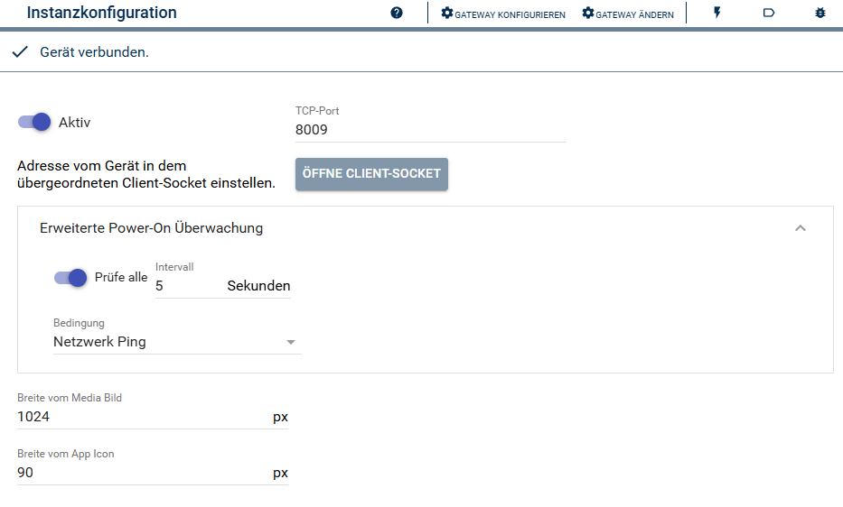
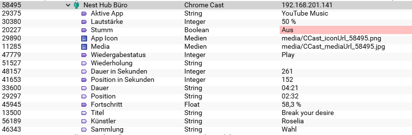
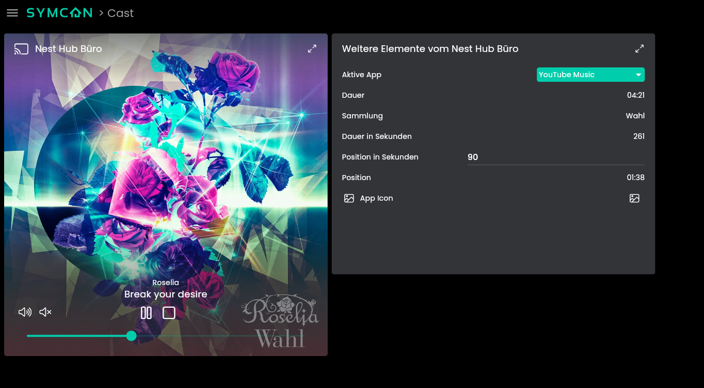
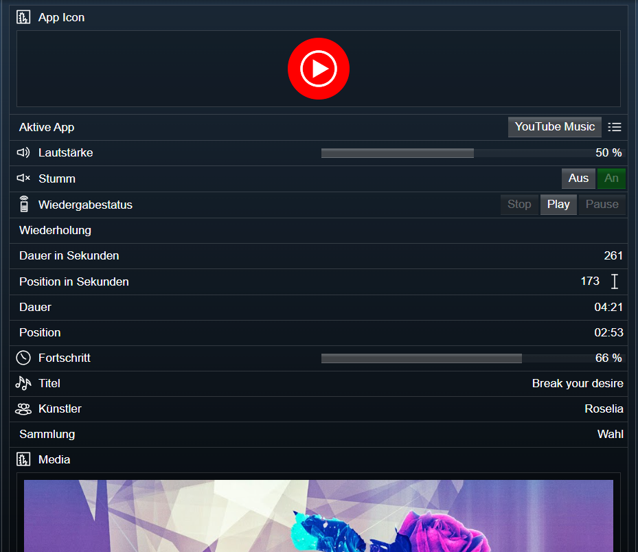

[](https://www.symcon.de/service/dokumentation/entwicklerbereich/sdk-tools/sdk-php/)
[]()
[](https://www.symcon.de/de/service/dokumentation/installation/migrationen/v80-v81-q3-2025/)  
[](https://creativecommons.org/licenses/by-nc-sa/4.0/)
[](https://github.com/Nall-chan/CCast/actions)
[](https://github.com/Nall-chan/CCast/actions)  
[](#2-spenden)[](#2-spenden)  

# Chrome Cast   <!-- omit in toc -->
Beschreibung des Moduls.

## Inhaltsverzeichnis   <!-- omit in toc -->

- [1. Funktionsumfang](#1-funktionsumfang)
- [2. Voraussetzungen](#2-voraussetzungen)
- [3. Software-Installation](#3-software-installation)
- [4. Einrichten der Instanzen in IP-Symcon](#4-einrichten-der-instanzen-in-ip-symcon)
- [5. Statusvariablen und Profile](#5-statusvariablen-und-profile)
    - [Statusvariablen](#statusvariablen)
  - [Profile](#profile)
- [6. Visualisierung](#6-visualisierung)
  - [1. Kachel-Visu](#1-kachel-visu)
  - [2. WebFront](#2-webfront)
- [7. PHP-Befehlsreferenz](#7-php-befehlsreferenz)
  - [Allgemeine Befehle:](#allgemeine-befehle)
  - [Streaming von Inhalten](#streaming-von-inhalten)
  - [Steuerung der Medienwiedergabe](#steuerung-der-medienwiedergabe)
- [8. Anhang](#8-anhang)
  - [1. Changelog](#1-changelog)
  - [2. Spenden](#2-spenden)
- [9. Lizenz](#9-lizenz)


## 1. Funktionsumfang

* Abbilden vom Status in Symcon
* Steuerung von Lautstärke und Medien
* Wiedergabe von Medien aus dem LAN per Default Media Render

## 2. Voraussetzungen

- IP-Symcon ab Version 8.1

## 3. Software-Installation

* Über den Module Store das 'Chrome Cast'-Modul installieren.

## 4. Einrichten der Instanzen in IP-Symcon

 Es wird empfohlen neue Instanzen über das [Discovery-Modul](../Chrome%20Cast%20Discovery/README.md) zu erstellen.
 Unter 'Instanz hinzufügen' kann das 'Chrome Cast'-Modul mithilfe des Schnellfilters gefunden werden.  
	- Weitere Informationen zum Hinzufügen von Instanzen in der [Dokumentation der Instanzen](https://www.symcon.de/service/dokumentation/konzepte/instanzen/#Instanz_hinzufügen)

__Konfigurationsseite__:

  

## 5. Statusvariablen und Profile

Die Statusvariablen/Kategorien werden automatisch angelegt. Das Löschen einzelner kann zu Fehlfunktionen führen.

  

#### Statusvariablen

| Name                 | Typ     | Beschreibung                                            |
| -------------------- | ------- | ------------------------------------------------------- |
| Aktive App           | string  | Aktuelle App                                            |
| Lautstärke           | integer | Lautstärke in %                                         |
| Stumm                | bool    | Stummschaltung                                          |
| Wiedergabestatus     | integer | Status bei Medienwiedergabe                             |
| Wiederholung         | string  | Wiederholung                                            |
| Dauer in Sekunden    | integer | Dauer der aktuellen Wiedergabe in Sekunden              |
| Dauer                | string  | Dauer der aktuellen Wiedergabe als Text                 |
| Position in Sekunden | integer | Position der aktuellen Wiedergabe in Sekunden           |
| Position             | string  | Position der aktuellen Wiedergabe als Text              |
| Fortschritt          | float   | Aktueller Fortschritt der aktuellen Wiedergabe          |
| Titel                | string  | Titel der aktuellen Wiedergabe                          |
| Künstler             | string  | Künstler der aktuelle Wiedergabe                        |
| Sammlung             | string  | Sammlung, Album, Playlist o.ä. der aktuellen Wiedergabe |


### Profile

| Name                    | Typ    | Genutzt durch                                  |
| ----------------------- | ------ | ---------------------------------------------- |
| CCast.AppId.<InstanzID> | string | Enthält alle für dieses Gerät verfügbaren Apps |


## 6. Visualisierung

### 1. Kachel-Visu
Die Funktionalität, die das Modul in der Kachel Visu bietet.  

  

### 2. WebFront
Die Funktionalität, die das Modul im WebFront bietet.  

  

## 7. PHP-Befehlsreferenz

### Allgemeine Befehle:

`bool CCAST_SetVolumen(integer $InstanzID, float $Level);`  
Setzt die Lautstärke auf den Wert von `Level`.  

Beispiel:  
`CCAST_SetVolumen(12345, 0.5);`  
Lautstärke auf 50% setzen.  

--- 
`bool CCAST_SetMute(integer $InstanzID, bool $Mute);`  
Setzt die Stummschaltung.   

Beispiel:  
`CCAST_SetMute(12345, true);`  
Gerät stumm schalten.  

---
`bool CCAST_LaunchApp(integer $InstanzID, string $AppId);`  
Startet eine Cast App.  

Kleine Auswahl von AppIds:  
| App                  | AppId    |
| -------------------- | -------- |
| Audible              | 25456794 |
| Backdrop             | E8C28D3C |
| CastBridge           | 46C1A819 |
| ChromeMirroring      | 0F5096E8 |
| DefaultMediaReceiver | CC1AD845 |
| DisneyPlus           | C3DE6BC2 |
| GooglePhotos         | 96084372 |
| GooglePodcast        | 3DFCDBD1 |
| Netflix              | CA5E8412 |
| ScreenMirroring      | 674A0243 |
| Spotify              | CC32E753 |
| YouTube              | 233637DE |
| YouTubeMusic         | 2DB7CC49 |

Beispiel:  
`CCAST_LaunchApp(12345, 'CC1AD845');`  
Default Media Render starten.  

---
`bool CCAST_GetAppAvailability(integer $InstanzID);`  
Aktuell nicht verfügbar  

Beispiel:  
`CCAST_GetAppAvailability(12345);`  

---
`bool CCAST_CloseApp(integer $InstanzID);`  
Beendet die aktuelle Cast App.  
Wird z.B. bei Android TV Geräten eine native App ausgeführt, so hat der Befehl darauf keinen Einfluss.  

Beispiel:  
`CCAST_CloseApp(12345);`  

---
`bool CCAST_RequestState(integer $InstanzID);`  
Frage den aktuellen Status ab.    

Beispiel:  
`CCAST_RequestState(12345);`  

---
`bool CCAST_RequestIdleState(integer $InstanzID);`  
Fragt den aktuellen Ruhemodus ab.  

Beispiel:  
`CCAST_RequestIdleState(12345);`  

---
`bool CCAST_SendCommand(integer $InstanzID, string $URN, string $Command, array $Payload = []);`  
Testfunktion.
Ermöglicht das Senden von einem Befehl mit Payload über eine spezifische URL an das Gerät.  

Beispiel:  
`CCAST_SendCommand(12345, 'urn:x-cast:com.google.cast.receiver', 'GET_STATUS', []);`  
Entspricht dem Befehl CCAST_RequestState.  

---
`bool CCAST_SendCommandToApp(integer $InstanzID, string $URN, string $Command, array $Payload = []);`  
Testfunktion.
Ermöglicht das Senden von einem Befehl mit Payload über eine spezifische URL an die laufende App (Session).  

Beispiel:  
`CCAST_SendCommandToApp(12345, 'urn:x-cast:com.google.cast.tp.connection', 'CLOSE', []);`  
Entspricht dem Befehl CCAST_CloseApp.  

### Streaming von Inhalten
 
`bool CCAST_PlayText(integer $InstanzID, string $Text, bool $CloseApp);`
Startet eine Sprachausgabe mit dem in `Text` übergebenen Inhalt auf dem Gerät.  
Der Parameter `CloseApp` sollte `true` sein, wenn keine weiteren Ausgaben oder Medien geladen werden.  

Beispiel:  
`CCAST_PlayText(12345, 'Achtung! Es folgt eine Durchsage.', false);`

---  
`bool CCAST_DisplayWebsite(integer $InstanzID, string $Url, bool $DisableInput, bool $AutoReload);`
Veranlasst das Gerät die in `Url` übergebene Website aufzurufen und darzustellen.  
Über `DisableInput` auf `true` wird eine Eingabe unterbunden.  
Der Parameter `AutoReload` sollte ein neu laden ermöglichen.  

Beispiel:  
`CCAST_DisplayWebsite(12345, 'https://community.symcon.de',false,true);`

---
`bool CCAST_LoadMediaURL(integer $InstanzID, string $Url, string $contentType, bool $isLive);`  
Startet den Default Media Receiver, sofern nicht schon gestartet, und lädt die in `Url` übergebene Quelle.  
Die Quelle muss ohne weitere Authentifizierung vom Gerät aus erreichbar sein.  
Der Default Media Receiver unterstützt keine Anmeldeverfahren. Auch ein übergeben von Anmeldedaten in der Url wird nicht funktionieren.  
Der Parameter `isLive` muss für Live-Streams `true` sein. Für normale Dateien wird `false` empfohlen.  
Der `contentType` sollte passend zur Quelle gewählt werden und entspricht den MIME-Typen.  
Wird ein leere String bei `contentType` übergeben, so wird versucht den richtigen Typ automatisch zu ermitteln.  

Auswahl von unterstützen und getesteten contentType`s:  
| contentType | Datei / Format |
| ----------- | -------------- |
| audio/mp3   | MP3            |
| audio/mpeg  | MP3            |
| video/mp4   | MP4            |
| image/png   | PNG Bild       |
| image/jpeg  | JPG Bild       |

Beispiel Live-Stream einer Kamera:  
`CCAST_LoadMediaURL(12345, 'http://meineKamera/video.mp4', 'video/mp4', true);`  

Beispiel Wiedergabe einer MP3 Datei:  
`CCAST_LoadMediaURL(12345, 'http://meinSymcon:3777/user/Alarmton.mp3', 'audio/mp3', false);`  

Beispiel Anzeige eines Bildes:  
`CCAST_LoadMediaURL(12345, 'https://upload.wikimedia.org/wikipedia/commons/a/ad/Reflection_nebula_IC_349_near_Merope.jpg', 'image/jpeg', false);`  

---
`bool CCAST_LoadMediaId(integer $InstanzID, string $contentId, string $contentType, bool $isLive);`  
Identisch zu `CCAST_LoadMediaURL`, jedoch wird hier eine `contentId` für die entsprechende Quelle erwartet.  

---
`bool CCAST_LoadMediaQueue(integer $InstanzID, array $Items, bool $Repeat, integer $StartIndex, bool $Autoplay);`
Lädt eine Liste von `Items` als Wiedergabeliste.  
Jeder Eintrag von `Items` muss mindestens das Feld `contentUrl` enthalten.  
Optional sind `streamType` und `contentType` möglich, wie bei den Funktionen zuvor.  
Außerdem können über das Feld `metadata` noch weitere Daten der Quelle, wie Titel, Bild/Thumbnail, Collection usw.. ergänzt werden.

Der Parameter `Repeat` kann für Wiederholung der Liste auf `true` gesetzt werden, sonst muss `false` angegeben werden.  
Der zuerst Wiedergegebene Eintrag ist in `StartIndex` zu übergeben und fängt mit 0 an.  
Über den Parameter `Autoplay` auf `true` kann die Wiedergabe sofort gestartet werden.  

Beispiel:  
```php
$Items = [
  [
    'contentUrl'  => 'http://meinSymcon:3777/user/Alarmton.mp3',
    'metadata'    =>  // metadate enthält zusätzliche Daten des Objektes
    [
      'title' => 'Achtung Achtung' // Anzeigetitel
    ]
  ],
  [
    'contentUrl' => 'http://meineKamera/videoStream',
    'streamType'  => 'LIVE',
    'contentType' => 'video/mp4',
    'metadata'    =>  // metadate enthält zusätzliche Daten des Objektes
    [
      'images' =>
      [
        [
          'url' => 'http://meineKamera/SnapshotBild.jpg'  //Vorschaubild
        ]
      ],
      'title' => 'Meine Kamera' // Anzeigetitel
    ]    
  ]
];
CCAST_LoadMediaQueue(12345, $Items, true, 1, true);
```  

### Steuerung der Medienwiedergabe

`bool CCAST_SetPlayerState(integer $InstanzID, string $State);`  
Sendet einen Steuerbefehl an die aktuelle Wiedergabe.  

Auswahl von bekannten Befehlen:  
| State      |
| ---------- |
| PLAY       |
| PAUSE      |
| STOP       |
| QUEUE_NEXT |
| QUEUE_PREV |

Beispiel:  
`CCAST_SetPlayerState(12345, 'PAUSE');`  
Pausiert die aktuelle Wiedergabe.  

---
`bool CCAST_Seek(integer $InstanzID, float $Time);`  
Springt auf den in `Time` übergebenen Zeitpunkt der Wiedergabe.  

Beispiel:  
`CCAST_Seek(12345, 30.5);`  
Springt bei der Aktuellen Wiedergabe auf 30,5 Sekunden.  

---
`bool CCAST_SeekRelative(integer $InstanzID, float $Time);`  
Spult die Wiedergabe um die in `Time` übergebenen Zeit vor oder zurück.  

Beispiel:  
`CCAST_SeekRelative(12345, -10);`  
Wiedergabe 10 Sekunden zurückspulen.  

---
`bool CCAST_SetRepeat(integer $InstanzID, string $Mode);`  
Steuert die Art der Wiederholung einer Wiedergabeliste.  
Wird nicht von allen Quellen unterstützt!  

| Werte von Mode   |
| ---------------- |
| QUEUE_REPEAT_OFF |
| QUEUE_REPEAT_ONE |
| QUEUE_REPEAT_ALL |


Beispiel:  
`CCAST_SetRepeat(12345, 'QUEUE_REPEAT_ALL');`  

---
`bool CCAST_Shuffle(integer $InstanzID);`  
Lässt die Wiedergabeliste durchmischen.  
Wird nicht von allen Quellen unterstützt!  

Beispiel:  
`CCAST_Shuffle(12345);`  

---
`bool CCAST_SetLike(integer $InstanzID, bool $Liked);`  
Erlaubt das setzen (`true`) oder löschen (`false`) eines Like der aktuellen Wiedergabe.  
Wird nicht von allen Quellen unterstützt!  

Beispiel:  
`CCAST_SetLike(12345,true);`  

---
`bool CCAST_SetDislike(integer $InstanzID, bool $Disliked);`  
Erlaubt das setzen (`true`) oder löschen (`false`) eines Dislike der aktuellen Wiedergabe.  
Wird nicht von allen Quellen unterstützt!  

Beispiel:  
`CCAST_SetDislike(12345,true);`  

---
`bool CCAST_DisplayLyrics(integer $InstanzID, bool $Showing);`  
Schaltet die Anzeige der Lyrics ein (`true`) oder aus (`false`).  
Wird nicht von allen Quellen unterstützt!  

Beispiel:  
`CCAST_DisplayLyrics(12345,true);`  

---
`bool CCAST_RequestMediaState(integer $InstanzID);`  
Fragt den aktuellen Status der Medienwiedergabe ab.  

Beispiel:  
`CCAST_RequestMediaState(12345);`  

## 8. Anhang

### 1. Changelog

[Changelog der Library](../README.md#2-changelog)

### 2. Spenden

Die Library ist für die nicht kommerzielle Nutzung kostenlos, Schenkungen als Unterstützung für den Autor werden hier akzeptiert:  

[](https://paypal.me/Nall4chan)  

[](https://www.amazon.de/hz/wishlist/ls/YU4AI9AQT9F?ref_=wl_share) 

## 9. Lizenz

  IPS-Modul:  
  [CC BY-NC-SA 4.0](https://creativecommons.org/licenses/by-nc-sa/4.0/)  
