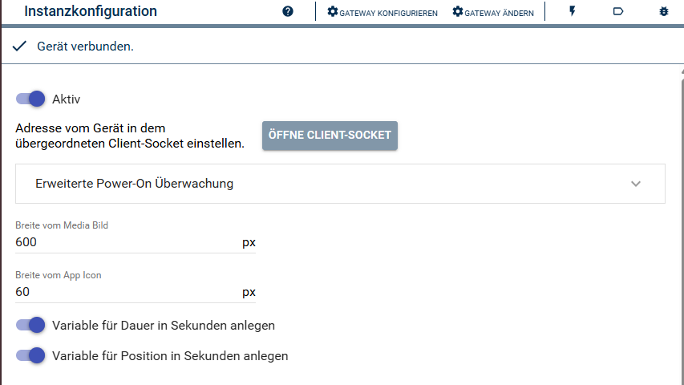
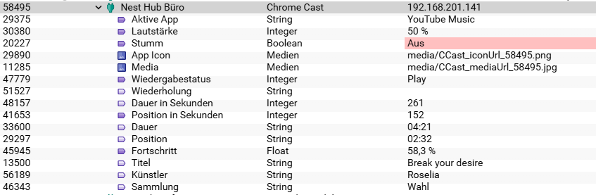
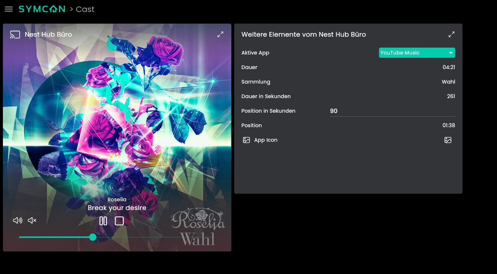
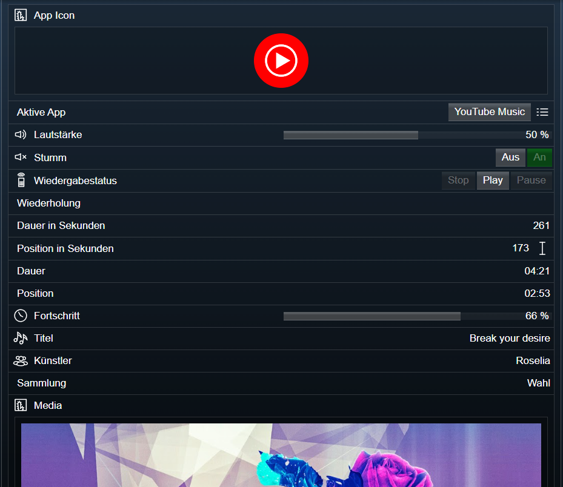

[](https://www.symcon.de/service/dokumentation/entwicklerbereich/sdk-tools/sdk-php/)
[](https://community.symcon.de/t/modul-chromecast-google-cast/141614)
[](https://www.symcon.de/de/service/dokumentation/installation/migrationen/v80-v81-q3-2025/)  
[](#10-lizenz)
[](https://github.com/Nall-chan/CCast/actions)
[](https://github.com/Nall-chan/CCast/actions)  
[](#2-spenden)
[](#2-spenden)

# Chrome Cast   <!-- omit in toc -->  

Einbinden eines Chrome Cast Gerätes in Symcon.  

## Inhaltsverzeichnis   <!-- omit in toc -->

- [1. Funktionsumfang](#1-funktionsumfang)
- [2. Voraussetzungen](#2-voraussetzungen)
- [3. Software-Installation](#3-software-installation)
- [4. Einrichten der Instanzen in IP-Symcon](#4-einrichten-der-instanzen-in-ip-symcon)
- [5. Statusvariablen](#5-statusvariablen)
  - [Profile](#profile)
- [6. Visualisierung](#6-visualisierung)
  - [Kachel Visualisierung](#kachel-visualisierung)
  - [WebFront Visualisierung](#webfront-visualisierung)
- [7. PHP-Befehlsreferenz](#7-php-befehlsreferenz)
  - [Allgemeine Befehle](#allgemeine-befehle)
  - [Streaming von Inhalten](#streaming-von-inhalten)
  - [Steuerung der Medienwiedergabe](#steuerung-der-medienwiedergabe)
- [8. Aktionen](#8-aktionen)
- [9. Anhang](#9-anhang)
  - [1. Changelog](#1-changelog)
  - [2. Spenden](#2-spenden)
- [10. Lizenz](#10-lizenz)

## 1. Funktionsumfang

- Abbilden vom Status in Symcon
- Steuerung von Lautstärke und Medien
- Wiedergabe von Medien aus dem LAN per Default Media Render

## 2. Voraussetzungen

- Symcon ab Version 8.1

## 3. Software-Installation

- Über den Module Store das 'Chrome Cast'-Modul installieren.

## 4. Einrichten der Instanzen in IP-Symcon

> [!TIP]
> Es wird empfohlen neue Instanzen über das [Discovery-Modul](../Chrome%20Cast%20Discovery/README.md) zu erstellen.

Unter 'Instanz hinzufügen' kann das 'Chrome Cast'-Modul mithilfe des Schnellfilters gefunden werden.  

- Weitere Informationen zum Hinzufügen von Instanzen in der [Dokumentation der Instanzen](https://www.symcon.de/service/dokumentation/konzepte/instanzen/#Instanz_hinzufügen)

__Konfigurationsseite__:

  

| Eigenschaft                                        | Name                | Typ     | Standardwert | Beschreibung                                                                                                   |
| -------------------------------------------------- | ------------------- | ------- | ------------ | -------------------------------------------------------------------------------------------------------------- |
| Aktiv                                              | `Open`              | boolean | `false`      | Verbindung zum Gerät aufbauen                                                                                  |
| Erweiterte Power-On Überwachung: Prüfe alle        | `Watchdog`          | boolean | `true`       | Prüft zyklisch, ob das Gerät erreichbar ist, und verbindet dann automatisch                                    |
| Erweiterte Power-On Überwachung: Intervall         | `Interval`          | integer | `5`          | Intervall der Prüfung in Sekunden (mindestens 5)                                                               |
| Erweiterte Power-On Überwachung: Bedingung         | `ConditionType`     | integer | `0`          | Art der Prüfung: `0` = Netzwerk Ping, `1` = Erweiterte Bedingung                                               |
| Erweiterte Power-On Überwachung: Erweiterte Bedingung | `WatchdogCondition` | string  | `''`         | Bedingung als JSON-String (Format wie bei [`IPS_IsConditionPassing`](https://www.symcon.de/en/service/documentation/command-reference/management-events/ips-isconditionpassing/)); am einfachsten über das Formular erstellen, nur bei `ConditionType` = `1` |
| Breite vom Media Bild                              | `MediaSizeWidth`    | integer | `512`        | Breite in Pixel des Medienbildes (Cover), 60 bis 3000                                                          |
| Breite vom App Icon                                | `AppIconSizeWidth`  | integer | `90`         | Breite in Pixel des App Icons, 60 bis 512                                                                      |
| Variable für Dauer in Sekunden anlegen             | `enableRawDuration` | boolean | `true`       | Legt die Statusvariable `Dauer in Sekunden` an                                                                 |
| Variable für Position in Sekunden anlegen          | `enableRawPosition` | boolean | `true`       | Legt die Statusvariable `Position in Sekunden` an                                                              |

Die Eigenschaften können auch per Skript geändert werden. Die Änderungen werden erst mit `IPS_ApplyChanges` übernommen:  

```php
IPS_SetProperty(12345, 'Interval', 30);
IPS_SetProperty(12345, 'enableRawPosition', false);
IPS_ApplyChanges(12345);
```

Die Adresse des Gerätes wird nicht hier, sondern im übergeordneten `Client Socket` eingetragen: Eigenschaften `Host` (string) und `Port` (integer, bei ChromeCast-Geräten üblicherweise `8009`). Bei Anlage über die Discovery werden beide Werte automatisch gesetzt.  

> [!IMPORTANT]
> `Open` sowie die SSL-Einstellungen des `Client Socket` werden von dieser Instanz verwaltet und sollten dort nicht verändert werden.

## 5. Statusvariablen

Die Statusvariablen/Kategorien werden automatisch angelegt.

> [!WARNING]
> Das Löschen einzelner Statusvariablen kann zu Fehlfunktionen führen.

  

| Name                 | Typ     | Beschreibung                                            |
| -------------------- | ------- | ------------------------------------------------------- |
| Aktive App           | string  | Aktuelle App                                            |
| Lautstärke           | integer | Lautstärke in %                                         |
| Stumm                | bool    | Stummschaltung                                          |
| Wiedergabestatus     | integer | Status bei Medienwiedergabe                             |
| Dauer in Sekunden    | integer | Dauer der aktuellen Wiedergabe in Sekunden (optional)   |
| Dauer                | string  | Dauer der aktuellen Wiedergabe als Text                 |
| Position in Sekunden | integer | Position der aktuellen Wiedergabe in Sekunden (optional)|
| Position             | string  | Position der aktuellen Wiedergabe als Text              |
| Fortschritt          | float   | Aktueller Fortschritt der aktuellen Wiedergabe          |
| Titel                | string  | Titel der aktuellen Wiedergabe                          |
| Künstler             | string  | Künstler der aktuelle Wiedergabe                        |
| Sammlung             | string  | Sammlung, Album, Playlist o.ä. der aktuellen Wiedergabe |

### Profile

| Name                      | Typ    | Genutzt durch                                  |
| ------------------------- | ------ | ---------------------------------------------- |
| CCast.AppId.`<InstanzID>` | string | Enthält die bekannten Apps sowie alle vom Gerät gemeldeten, automatisch gelernten Apps |
| CCast.DurationSeconds     | integer | Dauer in Sekunden                             |
| CCast.Duration            | string  | Dauer                                         |
| CCast.Position            | string  | Position                                      |
| CCast.Collection          | string  | Sammlung                                      |

Der Wiedergabestatus nutzt die Systemprofile `~Playback…`: Unterstützt die App Pause, werden nur Play/Pause angeboten (`~PlaybackNoStop` bzw. `~PlaybackPreviousNextNoStop`), sonst zusätzlich Stop. Zurück/Weiter erscheinen nur, wenn die App sie unterstützt.  

Meldet das Gerät eine App, welche noch nicht im Profil enthalten ist, wird diese automatisch aufgenommen (Name vom Gerät bzw. aus der öffentlichen App-Konfiguration von Google).  
Die gelernten Apps bleiben dauerhaft erhalten und können über die Schaltfläche `Gelernte Apps zurücksetzen` im Konfigurationsformular entfernt werden.  

## 6. Visualisierung

### Kachel Visualisierung

Die Funktionalität, die das Modul in der Kachel Visu bietet.  

  

### WebFront Visualisierung

Die Funktionalität, die das Modul im WebFront bietet.  

  

## 7. PHP-Befehlsreferenz

### Allgemeine Befehle  

```php
bool CCAST_SetVolume(integer $InstanzID, float $Level);
```

Setzt die Lautstärke auf den Wert von `Level` (0.0 bis 1.0).  
Die bisherige Funktion `CCAST_SetVolumen` ist weiterhin als veralteter Alias vorhanden.  

Beispiel:  

```php
CCAST_SetVolume(12345, 0.5);
```

Lautstärke auf 50% setzen.  

---  

```php
bool CCAST_SetMute(integer $InstanzID, bool $Mute);
```

Setzt die Stummschaltung.  

Beispiel:  

```php
CCAST_SetMute(12345, true);
```

Gerät stumm schalten.  

---  

```php
bool CCAST_LaunchApp(integer $InstanzID, string $AppId);
```

Startet eine Cast App.  

Kleine Auswahl von AppIds:  

| App                  | AppId    |
| -------------------- | -------- |
| Audible              | 25456794 |
| Backdrop             | E8C28D3C |
| CastBridge           | 46C1A819 |
| ChromeMirroring      | 0F5096E8 |
| DefaultMediaReceiver | CC1AD845 |
| DisneyPlus           | C3DE6BC2 |
| GooglePhotos         | 96084372 |
| GooglePodcast        | 3DFCDBD1 |
| Netflix              | CA5E8412 |
| ScreenMirroring      | 674A0243 |
| Spotify              | CC32E753 |
| YouTube              | 233637DE |
| YouTubeMusic         | 2DB7CC49 |

Beispiel:  

```php
CCAST_LaunchApp(12345, 'CC1AD845');
```

Default Media Render starten.  

---  

```php
bool CCAST_GetAppAvailability(integer $InstanzID);
```

> [!NOTE]
> Aktuell nicht verfügbar.

Beispiel:  

```php
CCAST_GetAppAvailability(12345);
```

---  

```php
bool CCAST_CloseApp(integer $InstanzID);
```

Beendet die aktuelle Cast App.  
Wird z.B. bei Android TV Geräten eine native App ausgeführt, so hat der Befehl darauf keinen Einfluss.  

Beispiel:  

```php
CCAST_CloseApp(12345);
```

---  

```php
bool CCAST_RequestState(integer $InstanzID);
```

Frage den aktuellen Status ab.  

Beispiel:  

```php
CCAST_RequestState(12345);
```

---  

```php
bool CCAST_RequestIdleState(integer $InstanzID);
```

Fragt den aktuellen Ruhemodus ab.  

Beispiel:  

```php
CCAST_RequestIdleState(12345);
```

### Streaming von Inhalten

```php
bool CCAST_PlayText(integer $InstanzID, string $Text, bool $CloseApp);
```

Startet eine Sprachausgabe mit dem in `Text` übergebenen Inhalt auf dem Gerät.  
Der Parameter `CloseApp` sollte `true` sein, wenn keine weiteren Ausgaben oder Medien geladen werden.  

Beispiel:  

```php
CCAST_PlayText(12345, 'Achtung! Es folgt eine Durchsage.', false);
```

---  

```php
bool CCAST_DisplayWebsite(integer $InstanzID, string $Url, bool $DisableInput, bool $AutoReload);
```

Veranlasst das Gerät die in `Url` übergebene Website aufzurufen und darzustellen.  
Über `DisableInput` auf `true` wird eine Eingabe unterbunden.  
Der Parameter `AutoReload` sollte ein neu laden ermöglichen.  

Beispiel:  

```php
CCAST_DisplayWebsite(12345, 'https://community.symcon.de', false, true);
```

---  

```php
bool CCAST_LoadMediaURL(integer $InstanzID, string $Url, string $contentType, bool $isLive);
```

Startet den Default Media Receiver, sofern nicht schon gestartet, und lädt die in `Url` übergebene Quelle.  

> [!IMPORTANT]
> Die Quelle muss ohne weitere Authentifizierung vom Gerät aus erreichbar sein.  
> Der Default Media Receiver unterstützt keine Anmeldeverfahren. Auch ein übergeben von Anmeldedaten in der Url wird nicht funktionieren.

Der Parameter `isLive` muss für Live-Streams `true` sein. Für normale Dateien wird `false` empfohlen.  
Der `contentType` sollte passend zur Quelle gewählt werden und entspricht den MIME-Typen.  
Wird ein leere String bei `contentType` übergeben, so wird versucht den richtigen Typ automatisch zu ermitteln.  

Auswahl von unterstützen und getesteten contentType`s:  

| contentType | Datei / Format |
| ----------- | -------------- |
| audio/mp3   | MP3            |
| audio/mpeg  | MP3            |
| video/mp4   | MP4            |
| image/png   | PNG Bild       |
| image/jpeg  | JPG Bild       |

Beispiel Live-Stream einer Kamera:  

```php
CCAST_LoadMediaURL(12345, 'http://meineKamera/video.mp4', 'video/mp4', true);
```

Beispiel Wiedergabe einer MP3 Datei:  

```php
CCAST_LoadMediaURL(12345, 'http://meinSymcon:3777/user/Alarmton.mp3', 'audio/mp3', false);
```

Beispiel Anzeige eines Bildes:  

```php
CCAST_LoadMediaURL(12345, 'https://upload.wikimedia.org/wikipedia/commons/a/ad/Reflection_nebula_IC_349_near_Merope.jpg', 'image/jpeg', false);
```

---  

```php
bool CCAST_LoadMediaId(integer $InstanzID, string $contentId, string $contentType, bool $isLive);
```

Identisch zu `CCAST_LoadMediaURL`, jedoch wird hier eine `contentId` für die entsprechende Quelle erwartet.  

---  

```php
bool CCAST_PlayYouTube(integer $InstanzID, string $VideoId, string $ListId = '');
```

Startet die YouTube App auf dem Chromecast, sofern nicht schon gestartet, und spielt das angegebene Video bzw. die Playlist ab.  

```php
bool CCAST_PlayYouTubeMusic(integer $InstanzID, string $VideoId, string $ListId = '');
```

Startet die YouTube Music App auf dem Chromecast, sofern nicht schon gestartet, und spielt den angegebenen Titel bzw. die Playlist ab.  

> [!IMPORTANT]
> Beide Funktionen erwarten **keine URL**, sondern nur die IDs aus der Adresse eines Videos, Titels oder einer Playlist.

Es ist kein Google-Konto und kein API-Key notwendig. Die Wiedergabe erfolgt ohne Nutzerbezug (keine eigenen Mixe, keine Likes).  

**Wo finde ich die IDs?**  
Video bzw. Titel im Browser oder per `Teilen` -> `Link kopieren` öffnen und die Adresse betrachten:  

| Adresse (Beispiel)                                                    | `VideoId`     | `ListId`                             |
| --------------------------------------------------------------------- | ------------- | ------------------------------------ |
| `https://www.youtube.com/watch?v=8-Qekf_GBow`                         | `8-Qekf_GBow` | `''`                                 |
| `https://youtu.be/8-Qekf_GBow?si=AbCdEfGh12345678`                    | `8-Qekf_GBow` | `''`                                 |
| `https://www.youtube.com/shorts/8-Qekf_GBow`                          | `8-Qekf_GBow` | `''`                                 |
| `https://music.youtube.com/watch?v=y0OovVJzJXY&list=RDAMVMy0OovVJzJXY` | `y0OovVJzJXY` | `RDAMVMy0OovVJzJXY`                  |
| `https://music.youtube.com/playlist?list=PLL9hR76gpuABM39W7VRZdCyYqTzoEDM4v` | `''`    | `PLL9hR76gpuABM39W7VRZdCyYqTzoEDM4v` |
| `https://music.youtube.com/playlist?list=OLAK5uy_nVAYpLix-FGE4fa2fYfi5ZG1fdSgt3bMA` (Album) | `''` | `OLAK5uy_nVAYpLix-FGE4fa2fYfi5ZG1fdSgt3bMA` |

- Die `VideoId` ist der Wert hinter `v=` (bzw. nach `youtu.be/` oder `shorts/`) und immer 11 Zeichen lang (Buchstaben, Ziffern, `-` und `_`).  
- Die `ListId` ist der Wert hinter `list=`. Typische Anfänge sind `PL…` (Playlist), `OLAK5uy_…` (Album bei YouTube Music) und `RD…` (automatischer Mix/Radio).  
- Alle anderen Parameter der Adresse werden **nicht** übergeben. Insbesondere ist `si=…` nur eine Kennung des Teilen-Links und keine Video-ID. Auch eine Startzeit (`t=…`) wird nicht unterstützt, hierfür nach dem Start `CCAST_Seek` nutzen.  
- Videos von YouTube können auch mit `CCAST_PlayYouTubeMusic` wiedergegeben werden und umgekehrt, sofern der Inhalt im jeweiligen Dienst verfügbar ist.  

> [!TIP]
> Ein Radio passend zu einem Titel erhält man über die `ListId` `RDAMVM` + `VideoId` (Beispiel siehe Tabelle).

**Kombinationen der Parameter:**  

| `VideoId` | `ListId` | Ergebnis                                                                                                    |
| --------- | -------- | ----------------------------------------------------------------------------------------------------------- |
| gesetzt   | leer     | Spielt das Video bzw. den Titel. Danach folgen ggf. automatische Vorschläge des Dienstes.                    |
| gesetzt   | gesetzt  | Spielt das Video bzw. den Titel und anschließend die weiteren Einträge der Playlist. **Empfohlen.**          |
| leer      | gesetzt  | Spielt die Playlist ab dem ersten Eintrag. Läuft bereits eine Wiedergabe in der App, so wird nur die Playlist getauscht und der laufende Titel nicht gewechselt. |
| leer      | leer     | Nicht zulässig.                                                                                             |

**Rückgabewert:**  
`true` bedeutet, dass das Gerät den Befehl angenommen hat. Ob die ID existiert, kann vorher nicht geprüft werden.  
Bei einer ungültigen oder nicht verfügbaren ID (z.B. Ländersperre, Altersfreigabe, privates Video) überspringt die App den Eintrag bzw. spielt einen Vorschlag ab.  
Ob die gewünschte Wiedergabe läuft, ist an den Statusvariablen `Titel` und `Künstler` zu erkennen.  
`false` mit Fehlermeldung erfolgt, wenn die App nicht gestartet werden konnte oder die YouTube Lounge die Anfrage ablehnt.  

Beispiele:  

```php
// Ein einzelnes Video in YouTube
CCAST_PlayYouTube(12345, '8-Qekf_GBow');

// Einen Titel in YouTube Music, gefolgt vom passenden Radio
CCAST_PlayYouTubeMusic(12345, 'y0OovVJzJXY', 'RDAMVMy0OovVJzJXY');

// Eine Playlist in YouTube Music vom Anfang
CCAST_PlayYouTubeMusic(12345, '', 'PLL9hR76gpuABM39W7VRZdCyYqTzoEDM4v');

// Ein Album in YouTube Music vom ersten Titel
CCAST_PlayYouTubeMusic(12345, '', 'OLAK5uy_nVAYpLix-FGE4fa2fYfi5ZG1fdSgt3bMA');
```

---  

```php
bool CCAST_LoadMediaQueue(integer $InstanzID, array $Items, bool $Repeat, integer $StartIndex, bool $Autoplay);
```

Lädt eine Liste von `Items` als Wiedergabeliste.  
Jeder Eintrag von `Items` muss mindestens das Feld `contentUrl` enthalten.  
Optional sind `streamType` und `contentType` möglich, wie bei den Funktionen zuvor.  
Außerdem können über das Feld `metadata` noch weitere Daten der Quelle, wie Titel, Bild/Thumbnail, Collection usw.. ergänzt werden.

Der Parameter `Repeat` kann für Wiederholung der Liste auf `true` gesetzt werden, sonst muss `false` angegeben werden.  
Der zuerst Wiedergegebene Eintrag ist in `StartIndex` zu übergeben und fängt mit 0 an.  
Über den Parameter `Autoplay` auf `true` kann die Wiedergabe sofort gestartet werden.  

Beispiel:  

```php
$Items = [
  [
    'contentUrl'  => 'http://meinSymcon:3777/user/Alarmton.mp3',
    'metadata'    =>  // metadate enthält zusätzliche Daten des Objektes
    [
      'title' => 'Achtung Achtung' // Anzeigetitel
    ]
  ],
  [
    'contentUrl' => 'http://meineKamera/videoStream',
    'streamType'  => 'LIVE',
    'contentType' => 'video/mp4',
    'metadata'    =>  // metadate enthält zusätzliche Daten des Objektes
    [
      'images' =>
      [
        [
          'url' => 'http://meineKamera/SnapshotBild.jpg'  //Vorschaubild
        ]
      ],
      'title' => 'Meine Kamera' // Anzeigetitel
    ]    
  ]
];
CCAST_LoadMediaQueue(12345, $Items, true, 1, true);
```  

### Steuerung der Medienwiedergabe

```php
bool CCAST_SetPlayerState(integer $InstanzID, string $State);
```

Sendet einen Steuerbefehl an die aktuelle Wiedergabe.  

Auswahl von bekannten Befehlen:  

| State      |
| ---------- |
| PLAY       |
| PAUSE      |
| STOP       |
| QUEUE_NEXT |
| QUEUE_PREV |

Beispiel:  

```php
CCAST_SetPlayerState(12345, 'PAUSE');
```

Pausiert die aktuelle Wiedergabe.  

---  

```php
bool CCAST_Seek(integer $InstanzID, float $Time);
```

Springt auf den in `Time` übergebenen Zeitpunkt der Wiedergabe.  

Beispiel:  

```php
CCAST_Seek(12345, 30.5);
```

Springt bei der Aktuellen Wiedergabe auf 30,5 Sekunden.  

---  

```php
bool CCAST_SeekRelative(integer $InstanzID, float $Time);
```

Spult die Wiedergabe um die in `Time` übergebenen Zeit vor oder zurück.  

Beispiel:  

```php
CCAST_SeekRelative(12345, -10);
```

Wiedergabe 10 Sekunden zurückspulen.  

---  

```php
bool CCAST_SetRepeat(integer $InstanzID, string $Mode);
```

Steuert die Art der Wiederholung einer Wiedergabeliste.  

> [!NOTE]
> Wird nicht von allen Quellen unterstützt!

| Werte von Mode         |
| ---------------------- |
| REPEAT_OFF             |
| REPEAT_SINGLE          |
| REPEAT_ALL             |
| REPEAT_ALL_AND_SHUFFLE |

Beispiel:  

```php
CCAST_SetRepeat(12345, 'REPEAT_ALL');
```

---  

```php
bool CCAST_Shuffle(integer $InstanzID);
```

Lässt die Wiedergabeliste durchmischen.  

> [!NOTE]
> Wird nicht von allen Quellen unterstützt!

Beispiel:  

```php
CCAST_Shuffle(12345);
```

---  

> [!NOTE]
> **`CCAST_SetLike`, `CCAST_SetDislike` und `CCAST_DisplayLyrics`:**  
> Diese Befehle muss die jeweilige App auf dem Gerät selbst umsetzen.  
> YouTube und YouTube Music melden zwar `LIKE`/`DISLIKE` als unterstützt, lehnen die Befehle aber mit `INVALID_COMMAND` ab (getestet mit angemeldetem Konto, auch bei per Handy oder Website gestarteter Wiedergabe).  
> Die Funktionen liefern dann `false` mit der Fehlermeldung des Gerätes.  

```php
bool CCAST_SetLike(integer $InstanzID, bool $Liked);
```

Erlaubt das setzen (`true`) oder löschen (`false`) eines Like der aktuellen Wiedergabe.  

> [!NOTE]
> Wird nicht von allen Quellen unterstützt!

Beispiel:  

```php
CCAST_SetLike(12345, true);
```

---  

```php
bool CCAST_SetDislike(integer $InstanzID, bool $Disliked);
```

Erlaubt das setzen (`true`) oder löschen (`false`) eines Dislike der aktuellen Wiedergabe.  

> [!NOTE]
> Wird nicht von allen Quellen unterstützt!

Beispiel:  

```php
CCAST_SetDislike(12345, true);
```

---  

```php
bool CCAST_DisplayLyrics(integer $InstanzID, bool $Showing);
```

Schaltet die Anzeige der Lyrics ein (`true`) oder aus (`false`).  

> [!NOTE]
> Wird nicht von allen Quellen unterstützt!

Beispiel:  

```php
CCAST_DisplayLyrics(12345, true);
```

---  

```php
bool CCAST_RequestMediaState(integer $InstanzID);
```

Fragt den aktuellen Status der Medienwiedergabe ab.  

Beispiel:  

```php
CCAST_RequestMediaState(12345);
```

## 8. Aktionen

**Grundsätzlich können alle bedienbaren Statusvariablen als Ziel einer [`Aktion`](https://www.symcon.de/service/dokumentation/konzepte/automationen/ablaufplaene/aktionen/) mit `Auf Wert schalten` angesteuert werden, so dass hier keine speziellen Aktionen benutzt werden müssen.**

## 9. Anhang

### 1. Changelog

[Changelog der Library](../README.md#2-changelog)

### 2. Spenden

Die Library ist für die nicht kommerzielle Nutzung kostenlos, Schenkungen als Unterstützung für den Autor werden hier akzeptiert:  

[](https://paypal.me/Nall4chan)  

[](https://www.amazon.de/hz/wishlist/ls/YU4AI9AQT9F?ref_=wl_share)  

## 10. Lizenz

  IPS-Modul:  
  [Custom NC-SA](../LICENSE)  
