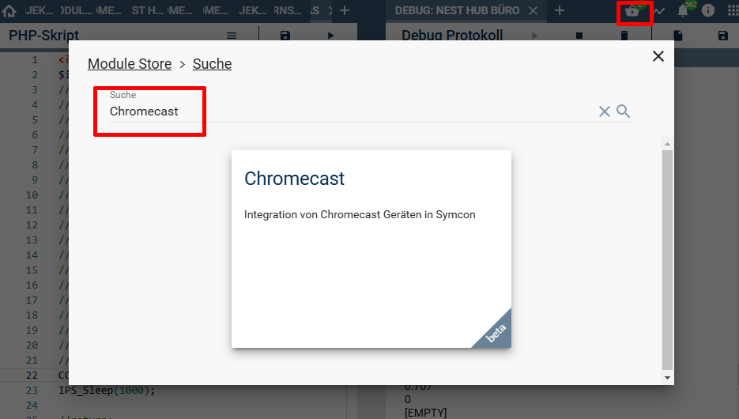

  

  
  

# Chrome Cast Library <!-- omit in toc -->  
Einbinden von Google Cast (ChromeCast) fähigen Geräten in Symcon.  

## Inhaltsverzeichnis <!-- omit in toc -->

- [1. Vorbemerkungen](#1-vorbemerkungen)
	- [Zur Library](#zur-library)
	- [Zur Integration von Geräten](#zur-integration-von-geräten)
- [2. Voraussetzungen](#2-voraussetzungen)
- [3. Software-Installation](#3-software-installation)
- [4. Enthaltende Module](#4-enthaltende-module)
- [5. Anhang](#5-anhang)
	- [1. GUID der Module](#1-guid-der-module)
	- [2. Changelog](#2-changelog)
	- [3. Spenden](#3-spenden)
- [6. Lizenz](#6-lizenz)

----------
## 1. Vorbemerkungen

### Zur Library

Diese Library befindet sich noch in der Testphase.  
Der Funktionsumfang kann, auch je nach Gerät, sich noch stark verändern.  
Ebenso ist es möglich das noch Fehlermeldungen auftreten oder gar die Verbindung zum Gerät verloren geht.

Feedback hierzu ist im Symcon Forum im entsprechenden Thread gerne erwünscht.  

----------
### Zur Integration von Geräten  

Getestet wurde zum Großteil mit einem Google Nest Hub und TV-Boxen / Android TVs verschiedener Hersteller.  
Bei nativen Android Geräten mit Android TV (Google TV) wurden nicht alle Funktionen getestet.  
Die Steuerung von nativen Android Apps auf diesen Geräten wird nur eingeschränkt möglich sein.  

## 2. Voraussetzungen

* IP-Symcon ab Version 8.1
* Geräte welche ChromeCast unterstützen (z.B. Nest Hub, Android TV usw.)
 
 ## 3. Software-Installation
  
  Über den 'Module-Store' in IPS das Modul `ChromeCast` hinzufügen.  
   **Bei kommerzieller Nutzung (z.B. als Errichter oder Integrator) wenden Sie sich bitte an den Autor.**  
 

  ## 4. Enthaltende Module

- __Chrome Cast Discovery__ ([Dokumentation](Chrome%20Cast%20Discovery/README.md))  
	Auffinden von ChromeCast fähigen Geräten im Netzwerk  

- __Chrome Cast__ ([Dokumentation](Chrome%20Cast/README.md))  
	Geräte Instanz welche ein ChromeCast Geräten in Symcon abbildet  

## 5. Anhang

###  1. GUID der Module
 
| Modul                 | Typ       | Prefix |                  GUID                  |
| :-------------------- | :-------- | :----: | :------------------------------------: |
| Chrome Cast Discovery | Discovery | CCAST  | {21E489CA-B260-4978-B038-B4AA5E07C17D} |
| Chrome Cast           | Gerät     | CCAST  | {9034A9D8-F004-22EA-9391-BF2E5E1CAB31} |

----------
### 2. Changelog

**Version 0.20:**  
- PHP-Befehle ergänzt um:
  - Repeat
  - Shuffle
  - Like & Dislike
  - Lyrics
  - TTS (Sprachausgabe)
  - Laden von Webseiten 
  
**Version 0.10:**  
- Test Release für Symcon 8.1  

----------
### 3. Spenden  
  
  Die Library ist für die nicht kommerzielle Nutzung kostenlos, Schenkungen als Unterstützung für den Autor werden hier akzeptiert:  

 

## 6. Lizenz

  IPS-Modul:  
  [CC BY-NC-SA 4.0](https://creativecommons.org/licenses/by-nc-sa/4.0/)  
 
