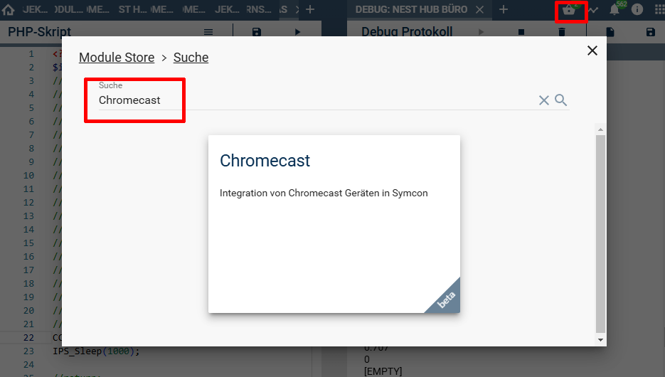

  

  

  

# Chrome Cast Library <!-- omit in toc -->  

Einbinden von Google Cast (ChromeCast) fähigen Geräten in Symcon.  

## Inhaltsverzeichnis <!-- omit in toc -->

- [1. Funktionsumfang](#1-funktionsumfang)
- [Vorbemerkungen](#vorbemerkungen)
  - [Zur Library](#zur-library)
  - [Zur Integration von Geräten](#zur-integration-von-geräten)
- [2. Voraussetzungen](#2-voraussetzungen)
- [3. Software-Installation](#3-software-installation)
- [4. Enthaltende Module](#4-enthaltende-module)
- [5. Anhang](#5-anhang)
  - [1. GUID der Module](#1-guid-der-module)
  - [2. Changelog](#2-changelog)
  - [3. Spenden](#3-spenden)
- [6. Lizenz](#6-lizenz)

----------

## 1. Funktionsumfang

Anbindung und Steuerung von Google Cast (ChromeCast) fähigen Geräten in IP-Symcon.

----------

## Vorbemerkungen

### Zur Library

> [!WARNING]
> Diese Library befindet sich noch in der Testphase.  
> Der Funktionsumfang kann, auch je nach Gerät, sich noch stark verändern.  
> Ebenso ist es möglich das noch Fehlermeldungen auftreten oder gar die Verbindung zum Gerät verloren geht.

Feedback hierzu ist im Symcon Forum im entsprechenden Thread gerne erwünscht.  

----------

### Zur Integration von Geräten  

Getestet wurde zum Großteil mit einem Google Nest Hub und TV-Boxen / Android TVs verschiedener Hersteller.  
Bei nativen Android Geräten mit Android TV (Google TV) wurden nicht alle Funktionen getestet.  
Die Steuerung von nativen Android Apps auf diesen Geräten wird nur eingeschränkt möglich sein.  

## 2. Voraussetzungen

- IP-Symcon ab Version 8.1
- Geräte welche ChromeCast unterstützen (z.B. Nest Hub, Android TV usw.)

## 3. Software-Installation
  
Über den 'Module-Store' in IPS das Modul `ChromeCast` hinzufügen.  

> [!IMPORTANT]
> Bei kommerzieller Nutzung (z.B. als Errichter oder Integrator) wenden Sie sich bitte an den Autor.

  

## 4. Enthaltende Module

- **Chrome Cast Discovery** ([Dokumentation](Chrome%20Cast%20Discovery/README.md))  
  Auffinden von ChromeCast fähigen Geräten im Netzwerk  

- **Chrome Cast** ([Dokumentation](Chrome%20Cast/README.md))  
  Geräte Instanz welche ein ChromeCast Geräten in Symcon abbildet  

## 5. Anhang

### 1. GUID der Module

| Modul                 | Typ       | Prefix |                  GUID                  |
| :-------------------- | :-------- | :----: | :------------------------------------: |
| Chrome Cast Discovery | Discovery | CCAST  | {21E489CA-B260-4978-B038-B4AA5E07C17D} |
| Chrome Cast           | Gerät     | CCAST  | {9034A9D8-F004-22EA-9391-BF2E5E1CAB31} |

----------

### 2. Changelog

**Version 0.30 (in Entwicklung):**  

- PHP-Befehle ergänzt um:  
  - `CCAST_PlayYouTube` / `CCAST_PlayYouTubeMusic` (YouTube Lounge API, Titel und Playlisten)
  - `CCAST_SetVolume` (ersetzt `CCAST_SetVolumen`, alter Name bleibt als Alias erhalten)
- Konfiguration: Statusvariablen `Dauer in Sekunden` und `Position in Sekunden` sind jetzt im Formular abschaltbar
- Statusvariablen `Aktive App`, `Dauer`, `Position`, `Dauer in Sekunden`, `Position in Sekunden` und `Sammlung` haben jetzt Profile mit Icon (Sekunden mit Einheit `s`)
- Wiedergabestatus: Unterstützt die App Pause, wird nur Play/Pause ohne Stop angeboten (vorher vertauscht)
- `CCAST_SetRepeat` erwartet die Cast-Werte `REPEAT_OFF`, `REPEAT_SINGLE`, `REPEAT_ALL`, `REPEAT_ALL_AND_SHUFFLE`
- Fehler bei Bedienaktionen (z.B. Gerät nicht verbunden, Timeout, Fehlermeldung vom Gerät) werden im Frontend angezeigt, bei Skripten und internen Abläufen als Fehlermeldung ausgegeben
- Vom Gerät gemeldete, unbekannte Apps werden automatisch in das App-Profil aufgenommen (zurücksetzbar im Formular)
- Protobuf-Bibliothek auf google/protobuf 5.36.2 aktualisiert (PHP 8.5 kompatibel)
- Lizenz geändert: von CC BY-NC-SA 4.0 auf eigene Lizenz (Custom NC-SA, siehe [LICENSE](LICENSE))
- Wiedergabestatus wird im Leerlauf korrekt für die Media-Kachel dargestellt
- Künstler wird bei Bedarf aus `albumArtist` bzw. `subtitle` ermittelt (z.B. YouTube Music Videos)
- `CCAST_PlayYouTube` / `CCAST_PlayYouTubeMusic` melden einen Fehler, wenn weder `VideoId` noch `ListId` übergeben wird
- Fehlerbehebungen:
  - `LAUNCH_ERROR` bzw. `LOAD_FAILED` vom Gerät wurden als Erfolg gewertet
  - `CCAST_CloseApp` hat nur die Verbindung zur App getrennt, die App lief weiter
  - Nach dem Beenden der Verbindung durch das Gerät liefen Folgebefehle ins Timeout
  - Nach dem Laden einer Wiedergabe blieb der Wiedergabestatus teilweise auf Stop stehen
  - Zu viele Statusabfragen beim Puffern bzw. Titelwechsel
  - `CCAST_DisplayWebsite` meldete nach 10 Sekunden fälschlich einen Fehler
  - Nach dem Laden einer Instanz wurde ohne aktive Verbindung kurzzeitig `Connected to ChromeCast` gemeldet und eine Statusabfrage gesendet
  - Warnungen `Socket ist nicht verbunden`, wenn ohne aktive Verbindung gesendet wurde
  - Mögliche Abbrüche (TypeError) bei leeren oder binären Cast-Nachrichten, fehlgeschlagenen Bild-Downloads, unbekannten Wiedergabezuständen und Positionen mit Nachkommastellen
  - Die Bedienbarkeit von Position/Fortschritt sowie das Profil vom Wiedergabestatus wurden nach dem Ende einer Wiedergabe nicht zurückgesetzt
  - Die Option für die Variable `Position in Sekunden` wurde nicht ausgewertet
  - App-Icon als Ersatzbild wurde nicht geladen
  - Discovery: Absicherung bei fehlender DNS-SD Instanz oder Geräten ohne Adresse

**Version 0.20:**  

- PHP-Befehle ergänzt um:  
  - Repeat
  - Shuffle
  - Like & Dislike
  - Lyrics
  - TTS (Sprachausgabe)
  - Laden von Webseiten
  
**Version 0.10:**  

- Test Release für Symcon 8.1  

----------

### 3. Spenden  
  
  Die Library ist für die nicht kommerzielle Nutzung kostenlos, Schenkungen als Unterstützung für den Autor werden hier akzeptiert:  

  

  

## 6. Lizenz

  IPS-Modul:  
  [Custom NC-SA](LICENSE)  
